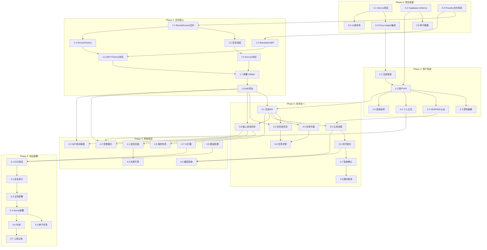

# 蓝血菁英 — 开发任务拆解（硅谷级精度）

> **版本：** v1.0
> **创建日期：** 2026-04-02
> **定位：** 高校顶尖人才区块链任务平台
> **技术栈：** Base链 + USDC Escrow + Privy MPC + SBT信誉 + NFT徽章
> **配套文档：** `docs/implementation-roadmap.md`

---

## 1. 项目评估摘要

| 维度 | 评估 |
|------|------|
| **难度等级** | 🟡 中高（7/10） |
| **MVP周期** | 3-5周（保守4周，乐观3周） |
| **风险等级** | 🟡 中高风险（合约安全+合规+冷启动三大威胁） |
| **团队规模** | 最小3人：1全栈(小code) + 1合约(小code兼任) + 1产品/运营(小research/小ops) |
| **核心挑战** | 智能合约安全审计、Privy国内可用性、冷启动双边市场 |
| **技术成熟度** | ⭐⭐⭐⭐⭐（全栈成熟技术，无技术盲区） |
| **架构复杂度** | ⭐⭐⭐（中等——链上+链下双系统，但逻辑清晰） |
| **创新难度** | ⭐⭐（模式已知，执行力是关键） |

### 1.1 难度拆解

| 模块 | 难度 | 说明 |
|------|------|------|
| 智能合约 | ⭐⭐⭐⭐ | 管理真实资金，需100%测试覆盖+安全审计 |
| 前端Web3集成 | ⭐⭐⭐ | Privy+wagmi+viem，生态成熟但调试链上交互有学习曲线 |
| 后端API | ⭐⭐ | 标准CRUD，Supabase大幅降低复杂度 |
| 数据模型 | ⭐⭐ | 清晰的ER关系，无复杂查询 |
| 部署运维 | ⭐ | Vercel+Supabase零运维 |
| 合规/运营 | ⭐⭐⭐⭐⭐ | 最大不确定性——监管+冷启动 |

---

## 2. Phase 拆解

> **规则：** 每个任务 ≤ 1天工作量 | 每个任务有明确验收标准 | 前置依赖清晰标注

---

### Phase 0: 项目地基（Day 1-2）🏗️

**目标：** 可运行的空项目骨架 + 数据库 + 钱包登录 + 基础UI组件库

| 任务ID | 任务名 | 负责Agent | 工时 | 前置依赖 | 验收标准 |
|--------|--------|-----------|------|----------|----------|
| **0.1** | 创建Next.js 14项目 + TailwindCSS + 深色主题配置 | 小code | 4h | 无 | ✅ `pnpm dev` 启动，深色主题背景 `#06080F` 渲染正确 |
| **0.2** | 初始化Supabase项目 + 数据库Schema迁移 | 小code | 4h | 无 | ✅ Supabase Dashboard可见全部表（users/bounties/applications/deliveries/reviews/reputation/transactions/notifications/user_skills/connections/verify_applications），RLS策略开启 |
| **0.3** | 初始化Foundry合约项目 + OpenZeppelin依赖 | 小code | 2h | 无 | ✅ `forge build` 编译通过，OpenZeppelin库引入成功 |
| **0.4** | 集成Privy React SDK + wagmi + Base测试网配置 | 小code | 3h | 0.1 | ✅ 点击登录按钮→Privy弹窗→邮箱登录→控制台输出钱包地址，Base Sepolia链ID正确 |
| **0.5** | 设计系统组件库（Button/Card/Input/Tag/Avatar/Badge） | 小code | 3h | 0.1 | ✅ Storybook或页面展示全部组件，深色主题风格统一 |
| **0.6** | 种子数据SQL（预设用户/任务/技能标签） | 小research | 2h | 0.2 | ✅ `seed.sql` 执行无错误，至少5个预设用户+3个预设任务 |

**Phase 0 里程碑：** Day 2 EOD → 项目骨架就绪，Privy登录可用，数据库Schema就绪

---

### Phase 1: 合约核心（Day 3-8）⛓️

**目标：** 部署在Base Sepolia测试网的完整合约套件 + 100%测试覆盖 + Slither安全扫描通过

| 任务ID | 任务名 | 负责Agent | 工时 | 前置依赖 | 验收标准 |
|--------|--------|-----------|------|----------|----------|
| **1.1** | BountyEscrow合约：状态机 + USDC存入/释放/退款 | 小code | 8h | 0.3 | ✅ `publish()`锁定USDC、`claim()`记录executor、`deliver()`状态转移、`approve()`释放90%+10%佣金、`cancel()`超时退款——全部逻辑编译通过 |
| **1.2** | BountyEscrow合约：安全加固（ReentrancyGuard + Pausable + 单笔限额$10K） | 小code | 4h | 1.1 | ✅ 重入攻击测试revert、pause后不可操作、超额金额revert |
| **1.3** | ReputationSBT合约（ERC-5192）：铸造 + 不可转让 + 元数据 | 小code | 6h | 0.3 | ✅ `mint()`成功铸造、`transfer()`始终revert、`tokenURI()`返回JSON元数据（任务ID+评分+时间戳） |
| **1.4** | EscrowFactory合约：一键创建BountyEscrow实例 | 小code | 4h | 1.1 | ✅ `createBounty()`部署新Escrow合约、Factory记录所有实例地址、事件 `BountyCreated` 正确emit |
| **1.5** | 合约单元测试——BountyEscrow（正向+逆向用例） | 小code | 6h | 1.1, 1.2 | ✅ `forge coverage` 行覆盖率 ≥ 95%，至少20个测试用例覆盖全部状态转换 |
| **1.6** | 合约单元测试——ReputationSBT + EscrowFactory | 小code | 4h | 1.3, 1.4 | ✅ SBT不可转让测试、Factory创建+追踪测试，覆盖率 ≥ 95% |
| **1.7** | 合约部署到Base Sepolia + Slither静态分析 | 小code | 3h | 1.5, 1.6 | ✅ BaseScan可查合约地址、Slither报告0个High/Medium漏洞 |
| **1.8** | 合约ABI导出 + 前端TypeScript类型生成 | 小code | 2h | 1.7 | ✅ `abi/` 目录包含JSON ABI + wagmi hooks自动生成的TypeScript类型 |

**Phase 1 里程碑：** Day 8 EOD → 合约部署测试网，测试覆盖率 ≥ 95%，Slither清零High/Medium

---

### Phase 2: 用户系统（Day 6-10）👤

**目标：** 完整的用户注册→登录→资料→认证→个人主页链路

> **注意：** Phase 2 与 Phase 1 可并行（Day 6-8重叠）

| 任务ID | 任务名 | 负责Agent | 工时 | 前置依赖 | 验收标准 |
|--------|--------|-----------|------|----------|----------|
| **2.1** | 注册/登录页面UI + Privy认证集成 | 小code | 6h | 0.4 | ✅ 邮箱注册→Privy创建账户→跳转资料编辑页；登录→JWT存入Cookie→跳转首页 |
| **2.2** | 用户API：注册回调 + JWT中间件 + CRUD | 小code | 6h | 0.2, 2.1 | ✅ `POST /api/users` 创建用户记录（含privy_wallet_address）、`GET /api/users/me` 返回当前用户、`PUT /api/users/me` 更新资料、未登录请求返回401 |
| **2.3** | 个人资料编辑页（头像上传+技能标签+简介+学校+公司） | 小code | 6h | 2.2 | ✅ 上传头像到Supabase Storage、技能标签多选+自定义、保存后数据持久化 |
| **2.4** | VERIFIED认证申请流程 | 小code | 4h | 2.2 | ✅ 填写认证类型+提交证明链接→写入verify_applications表、管理员后台审核（简化：直接DB操作） |
| **2.5** | 个人主页（自己/他人） | 小code | 6h | 2.2 | ✅ 显示头像+姓名+技能标签+简介+链上信誉分+已完成任务数、查看他人主页有"发起连接"按钮 |
| **2.6** | 连接请求功能 | 小code | 3h | 2.2 | ✅ 发送/接受/拒绝连接请求、互相连接后可查看联系方式 |

**Phase 2 里程碑：** Day 10 EOD → 用户注册→资料→认证→主页全流程可用

---

### Phase 3: 任务池核心（Day 10-17）⭐ 关键路径

**目标：** 完整的任务发布→接单→交付→验收→链上结算全链路

| 任务ID | 任务名 | 负责Agent | 工时 | 前置依赖 | 验收标准 |
|--------|--------|-----------|------|----------|----------|
| **3.1** | 任务API：CRUD + 状态管理 + 权限校验 | 小code | 8h | 2.2, 1.8 | ✅ `POST /api/bounties` 创建任务、`GET /api/bounties` 列表（分页+筛选）、`GET /api/bounties/[id]` 详情、状态只能向前流转、只有发布方可审核认领 |
| **3.2** | 任务发布页面（表单 + USDC存入Escrow） | 小code | 8h | 3.1, 1.8 | ✅ 填写标题/描述/标签/金额/截止日期→点击发布→MetaMask/Privy签名→USDC Approve+Transfer→Escrow锁定→BaseScan可查交易→任务出现在列表 |
| **3.3** | 任务列表页（筛选Pills + 搜索 + 卡片布局） | 小code | 6h | 3.1 | ✅ 按分类筛选实时过滤、文本搜索支持中英文、按最新/悬赏/截止排序、分页滚动加载 |
| **3.4** | 任务详情页（Markdown渲染 + 链上状态 + 发布方信息） | 小code | 6h | 3.3 | ✅ Markdown代码块语法高亮、链上Escrow金额实时显示、发布方信誉分+历史任务数展示 |
| **3.5** | 认领申请流程（申请→审核→确认） | 小code | 6h | 3.1, 2.4 | ✅ VERIFIED用户可申请（非VERIFIED按钮置灰+提示）、发布方查看申请者列表+信誉分、确认认领后合约状态 Open→InProgress |
| **3.6** | 交付提交（工程师端） | 小code | 4h | 3.5 | ✅ 填写交付说明+附GitHub/文档链接→状态 Delivered、发布方收到通知 |
| **3.7** | 验收确认（发布方端）：确认→资金释放 / 要求修改 | 小code | 6h | 3.6, 1.8 | ✅ 确认验收→合约 `approve()` → 90% USDC到工程师钱包+10%到平台钱包→状态 Completed；要求修改→附意见→状态回 InProgress |
| **3.8** | 链上状态同步（监听合约事件→更新DB） | 小code | 6h | 1.8, 3.1 | ✅ 合约事件（BountyCreated/Claimed/Delivered/Completed/Cancelled）触发后30秒内DB状态更新 |
| **3.9** | 超时取消 + 退款逻辑 | 小code | 4h | 3.7 | ✅ 截止日期+7天宽限期后退款按钮可用→一键退款→Escrow释放→状态 Cancelled |

**Phase 3 里程碑：** Day 17 EOD → ⭐ 核心交易闭环全链路可用（端到端跑通一笔任务）

---

### Phase 4: 信誉 + 钱包 + 通知 + 收尾（Day 17-22）💰

**目标：** 补齐钱包/信誉/通知功能 + UI打磨

| 任务ID | 任务名 | 负责Agent | 工时 | 前置依赖 | 验收标准 |
|--------|--------|-----------|------|----------|----------|
| **4.1** | 钱包页面：USDC余额 + 交易记录 + 充值引导 | 小code | 6h | 3.8 | ✅ 实时显示Base链上USDC余额、交易记录列表（时间+类型+金额+tx_hash）、CEX充值教程链接 |
| **4.2** | 信誉分展示：个人主页信誉分 + 信誉等级 + SBT列表 | 小code | 4h | 1.8, 2.5, 3.8 | ✅ 个人主页显示信誉分（0-100）+等级（新手/可靠/精英/传说）+已获得SBT数量 |
| **4.3** | 任务完成后自动铸造SBT | 小code | 4h | 1.8, 3.8 | ✅ 验收完成后30秒内ReputationSBT铸造成功→BaseScan可查→个人主页更新 |
| **4.4** | 站内通知系统 | 小code | 4h | 3.5, 3.6 | ✅ 认领申请/验收确认/资金到账等关键事件推送通知、通知列表+已读/未读状态 |
| **4.5** | 我的任务页（我发布的/我认领的 Tab切换） | 小code | 4h | 3.1 | ✅ Tab切换正常、任务状态标签正确、可跳转到详情 |
| **4.6** | 充值/提现引导页面（图文教程） | 小code | 3h | 4.1 | ✅ CEX→Privy钱包充值步骤截图+文字说明、提现到CEX步骤说明 |
| **4.7** | 整体UI打磨 + 移动端响应式适配 | 小code | 6h | 全部 | ✅ 320px-430px移动端布局正常、底部Tab栏固定、卡片圆角阴影风格统一、空状态页友好提示 |
| **4.8** | 错误处理 + Loading状态 + 边界Case | 小code | 4h | 全部 | ✅ 余额不足/网络断开/交易失败/空列表等场景有友好提示、Loading骨架屏 |

**Phase 4 里程碑：** Day 22 EOD → 功能完整，UI打磨就绪，准备测试

---

### Phase 5: 测试 + 安全 + 部署（Day 22-28）🚀

**目标：** 端到端测试通过 + 安全审计 + 主网部署 + 种子任务上线

| 任务ID | 任务名 | 负责Agent | 工时 | 前置依赖 | 验收标准 |
|--------|--------|-----------|------|----------|----------|
| **5.1** | 端到端测试：完整用户旅程 × 2 | 小ops | 6h | Phase 4 | ✅ 工程师旅程（注册→认证→接单→交付→收款→信誉）全流程无Bug；企业旅程（注册→充值→发布→审核→验收→付款）全流程无Bug |
| **5.2** | 安全审计：合约内部审计 + Slither复扫 | 小code | 4h | 5.1 | ✅ 无High/Medium漏洞、关键路径人工Review通过、Gas优化建议已处理 |
| **5.3** | 合约部署到Base主网 + 前端配置切换 | 小code | 3h | 5.2 | ✅ BaseScan主网可查合约、前端自动连接主网、USDC合约地址正确 |
| **5.4** | 前端部署Vercel + 域名配置 + HTTPS | 小ops | 3h | 5.3 | ✅ HTTPS访问正常、移动端Safari/Chrome正常渲染、CDN缓存生效 |
| **5.5** | 种子任务发布（OPENCAIO官方 ≥ 20个真实任务） | 小research | 4h | 5.4 | ✅ 20+个任务覆盖至少4个分类（本地化部署/AI模型/Agent开发/Web3）、每个任务 ≥ $100 USDC |
| **5.6** | 5人内测 + Bug修复 | 小ops+小code | 8h | 5.4 | ✅ 5名非Web3背景测试者完成全流程、P0/P1 Bug清零 |
| **5.7** | 正式上线：公告 + 社群推送 | 小research | 2h | 5.6 | ✅ 上线公告发布、OPENCAIO社群首批邀请发送 |

**Phase 5 里程碑：** Day 28 EOD → 🚀 正式上线！

---

## 3. 关键路径分析

### 3.1 关键路径（最长依赖链）

```
0.1 项目初始化
 → 0.4 Privy集成
  → 2.1 注册登录
   → 2.2 用户API
    → 3.1 任务API ← 1.8 合约ABI导出 ← 1.7 合约部署 ← 1.5 合约测试 ← 1.1 Escrow合约 ← 0.3 Foundry初始化
     → 3.2 任务发布页面
      → 3.5 认领流程
       → 3.6 交付提交
        → 3.7 验收确认
         → 5.1 E2E测试
          → 5.3 主网部署
           → 5.7 正式上线
```

**关键路径总工时：** ~90h（约12个工作日，含依赖等待）

### 3.2 可并行路径

```
         ┌── Phase 1 (合约) ──────────────────────┐
Phase 0 ─┤                                         ├── Phase 3 (任务池) ── Phase 4 ── Phase 5
         └── Phase 2 (用户系统) ──────────────────┘
```

| 并行组 | 路径A | 路径B | 并行时段 |
|--------|-------|-------|---------|
| 并行1 | Phase 1 合约开发(Day 3-8) | Phase 2 用户系统前半段(Day 6-10) | Day 6-8 |
| 并行2 | Phase 1 合约测试/部署(Day 7-8) | Phase 2 用户系统(Day 8-10) | Day 8 |

### 3.3 瓶颈分析

| 瓶颈 | 原因 | 影响 | 缓解 |
|------|------|------|------|
| **合约开发** | 单人(小code)负责，工作量集中 | 前端等合约ABI | 先用Mock ABI开发前端，合约就绪后替换 |
| **链上调试** | Web3交互调试耗时 | 延迟前端进度 | 预留充足buffer，优先集成测试网 |
| **USDC精度** | 6位小数(非18位)，容易出错 | 合约Bug | 严格使用 `SafeERC20`，单元测试覆盖精度边界 |

---

## 4. 依赖关系图

### 4.1 任务依赖 DAG



### 4.2 外部依赖

| 依赖项 | 类型 | 来源 | 影响 | 替代方案 |
|--------|------|------|------|---------|
| Privy App ID | 配置 | privy.io 注册 | 阻塞登录功能 | Dynamic / Biconomy |
| Base Sepolia USDC | 测试币 | Coinbase Faucet | 阻塞合约测试 | 使用Mock ERC20 |
| Base主网USDC | 合约地址 | BaseScan | 阻塞主网支付 | 使用原生USDC合约 `0x833589fCD6eDb6E08f4c7C32D4f71b54bdA02913` |
| Supabase项目 | 配置 | supabase.com | 阻塞数据库 | 自建PostgreSQL |
| Vercel项目 | 配置 | vercel.com | 阻塞部署 | 自托管Next.js |
| OpenZeppelin库 | npm/forge | npm/Foundry | 阻塞合约开发 | 手写标准实现(不推荐) |

---

## 5. 资源分配建议

### 5.1 Agent角色映射

| Agent | 角色 | 职责 | Phase投入 |
|-------|------|------|-----------|
| **小code** | 全栈+合约开发 | Next.js前端 + API Routes + Solidity合约 | Phase 0-5 全程主力 |
| **小ops** | 运维+测试 | E2E测试、部署、环境配置、内测组织 | Phase 4-5 为主 |
| **小research** | 产品+运营 | 种子数据、种子任务、文案、上线公告、用户调研 | Phase 0 + Phase 5 为主 |

### 5.2 工时分配

```
小code (全职投入，~8h/天):
  Phase 0: 16h (Day 1-2)
  Phase 1: 37h (Day 3-8)
  Phase 2: 31h (Day 6-10，与Phase 1并行部分)
  Phase 3: 54h (Day 10-17)
  Phase 4: 31h (Day 17-22)
  Phase 5: 15h (Day 22-28)
  总计: ~184h (约23天)

小ops (半职投入，~4h/天):
  Phase 0-3: 配置协助 + CI/CD搭建 (~12h)
  Phase 4: 部署环境准备 (~8h)
  Phase 5: E2E测试 + 部署 + 内测 (~20h)
  总计: ~40h (约10天)

小research (按需投入):
  Phase 0: 种子数据 (~2h)
  Phase 2-3: 产品走查 (~8h)
  Phase 5: 种子任务+上线公告 (~6h)
  总计: ~16h (约4天)
```

### 5.3 并行策略

```
Week 1 (Day 1-7):
  小code: Phase 0 → Phase 1 合约 + Phase 2 前半
  小ops:  CI/CD + Vercel/Supabase环境配置
  小research: 种子数据 + 竞品调研

Week 2 (Day 8-14):
  小code: Phase 2 后半 → Phase 3 前半
  小ops:  测试环境搭建 + 基础E2E框架
  小research: 文案准备 + 走查

Week 3 (Day 15-21):
  小code: Phase 3 后半 → Phase 4
  小ops:  E2E测试 + 安全扫描
  小research: 种子任务准备 + 充提教程

Week 4 (Day 22-28):
  小code: Bug修复 + 主网部署
  小ops:  内测组织 + Vercel部署
  小research: 种子任务上线 + 公告
```

---

## 6. 技术难点清单

### 6.1 🔴 高难度（必须攻克）

| # | 难点 | 模块 | 难度 | 说明 | 解决策略 |
|---|------|------|------|------|---------|
| D1 | **合约安全审计** | 合约 | ⭐⭐⭐⭐⭐ | Escrow管理真实资金，任何漏洞=资金损失 | OpenZeppelin标准库 + ReentrancyGuard + 100%测试覆盖 + Slither + 内部人工审计 + 单笔$10K限额 + Pausable |
| D2 | **Privy国内可用性** | 前端 | ⭐⭐⭐⭐ | Privy服务器在海外，国内访问可能不稳定 | (1) 前端CDN加速 (2) MetaMask直连fallback (3) 钱包接口抽象层便于切换 (4) 测试国内访问延迟 |
| D3 | **链上-链下状态一致性** | 全栈 | ⭐⭐⭐⭐ | DB状态 vs 链上状态可能不一致（网络延迟、交易失败） | (1) 合约事件监听作为Source of Truth (2) 定时Reconcile任务 (3) 关键操作先写DB Pending状态，链上确认后Final |

### 6.2 🟡 中难度（需要关注）

| # | 难点 | 模块 | 难度 | 说明 | 解决策略 |
|---|------|------|------|------|---------|
| D4 | **USDC 6位小数精度** | 合约 | ⭐⭐⭐ | USDC是6位小数(非18位)，前端/合约精度转换容易出错 | 使用 `SafeERC20`、所有金额用 `BigInt` 处理、单元测试覆盖边界值 |
| D5 | **EscrowFactory Gas优化** | 合约 | ⭐⭐⭐ | 每个任务部署独立合约，Gas成本需优化 | 考虑用 proxy pattern (EIP-1167 Minimal Proxy) 降低部署成本 |
| D6 | **Base链生态成熟度** | 基础设施 | ⭐⭐⭐ | Base链2023年才上线，部分工具可能不完善 | 合约代码兼容EVM标准，必要时可迁移Arbitrum/Optimism |
| D7 | **前端Web3调试** | 前端 | ⭐⭐⭐ | 链上交易调试复杂，错误信息不直观 | 搭建Base Sepolia测试环境、使用Tenderly跟踪交易、完善错误提示 |

### 6.3 🟢 低难度（标准开发）

| # | 难点 | 模块 | 难度 | 说明 |
|---|------|------|------|------|
| D8 | Supabase RLS策略 | 后端 | ⭐⭐ | 标准配置，文档完善 |
| D9 | Markdown渲染 | 前端 | ⭐⭐ | react-markdown + 代码高亮插件 |
| D10 | 响应式适配 | 前端 | ⭐⭐ | TailwindCSS移动优先，430px基准 |

---

## 7. 风险矩阵（概率 × 影响）

### 7.1 风险矩阵图

```
影响 →  极高         高           中           低
概率 ↓
40%+ │              🔴M2                       │
     │                                          │
30%+ │    🔴T1     🟡M3 🟡O1                   │
     │    🔴L1     🟡O4                         │
     │              🟡T3                         │
20%+ │              🟡L3         🟡O2 🟡T2     │
     │                           🟡M1           │
10%+ │                           🟡L2           🟢O3
     │                                          🟢T4
 5%+ │              🟡T3                         │
     │                                          │
     └──────────────────────────────────────────┘
```

### 7.2 风险详表（按优先级排序）

| 优先级 | 编号 | 风险 | 概率 | 影响 | 风险值 | 缓解行动 | 负责人 | 截止时间 |
|--------|------|------|------|------|--------|---------|--------|---------|
| **P0** | T1 | 合约安全漏洞 | 30% | 极高 | 🔴 9.0 | Slither + 内部审计 + 单笔$10K限额 + Pausable | 小code | Phase 1 |
| **P0** | L1 | 中国加密监管 | 25% | 极高 | 🔴 8.5 | 海外部署 + 用户协议排除大陆 + 法务确认 | 小research | Phase 5前 |
| **P0** | M2 | Web3用户接受度 | 40% | 高 | 🔴 8.0 | Privy无感上链 + 5人可用性测试 + "资金安全"话术 | 小code+小research | Phase 4 |
| **P1** | M3 | 冷启动任务不足 | 35% | 高 | 🟡 7.0 | OPENCAIO 50个种子任务 + 首月0佣金 | 小research | Phase 5 |
| **P1** | O1 | 冷启动失败 | 30% | 高 | 🟡 6.5 | 设定KPI(上线2周100注册+20任务)，未达标pivot | 小research | 上线后2周 |
| **P1** | O4 | 团队执行延期 | 20% | 高 | 🟡 5.5 | 严格MVP范围 + 20%buffer + 每周进度同步 | 小code | 全程 |
| **P2** | T3 | Privy不可用 | 5% | 高 | 🟡 4.5 | MetaMask fallback + 钱包接口抽象 | 小code | Phase 0 |
| **P2** | O2 | 任务质量失控 | 25% | 中 | 🟡 4.0 | VERIFIED门槛 + 评价系统 | 小research | Phase 3 |
| **P2** | L3 | 劳务税务合规 | 20% | 中 | 🟡 3.5 | 用户协议明确撮合定位 | 小research | Phase 5前 |
| **P2** | M1 | 竞品抢占 | 30% | 中 | 🟡 3.5 | 聚焦中文AI社区 + 链上信誉壁垒 | 小research | 持续 |
| **P3** | T2 | 链上交易延迟 | 10% | 中 | 🟢 2.5 | 进度条 + 重试机制 | 小code | Phase 3 |
| **P3** | L2 | 数据隐私 | 10% | 中 | 🟢 2.0 | 隐私政策 + 数据最小化 | 小research | Phase 5前 |
| **P3** | O3 | USDC流动性 | 10% | 低 | 🟢 1.5 | CEX充值教程 | 小research | Phase 4 |
| **P3** | T4 | 前端性能 | 20% | 低 | 🟢 1.5 | SWR缓存 + 异步加载 | 小code | Phase 4 |

### 7.3 Top 5 风险缓解行动计划

| 行动 | 关联风险 | 具体步骤 | 完成标准 |
|------|---------|---------|---------|
| 合约安全三重验证 | T1 | ① Slither扫描 ② 人工Code Review ③ 测试网1周模拟运行 | 0个High/Medium漏洞 |
| 合规防火墙 | L1 | ① 法务确认运营方案 ② 用户协议+隐私政策 ③ 服务器海外部署 ④ 用户协议排除大陆 | 法务签字确认 |
| 无感上链体验 | M2 | ① Privy集成 ② 5人可用性测试 ③ "资金安全托管"话术替换"区块链" | 5人完成全流程平均<15min |
| 种子任务蓄水 | M3,O1 | ① 准备50个种子任务模板 ② 上线前发布20个 ③ 首月0佣金 | 上线日20+活跃任务 |
| MetaMask Fallback | T3 | ① 钱包接口抽象 ② MetaMask直连备选 ③ 降级提示UI | Privy不可用时用户仍可操作 |

---

## 8. 验收标准总表

### 8.1 按Phase验收

| Phase | 验收标准 | 验收方式 |
|-------|---------|---------|
| **Phase 0** | 项目可运行 + 数据库就绪 + Privy登录可用 + UI组件库完成 | 截图/录屏 |
| **Phase 1** | 合约部署测试网 + 测试覆盖≥95% + Slither 0个High/Medium | 测试报告 + Slither日志 |
| **Phase 2** | 注册→登录→资料→认证→主页全流程可用 | 端到端走查 |
| **Phase 3** | 任务发布→接单→交付→验收→链上结算全链路跑通 | 基于BaseScan的交易证明 |
| **Phase 4** | 钱包/信誉/通知功能可用 + UI打磨完成 + 移动端适配正常 | 截图/录屏 |
| **Phase 5** | 5人内测通过 + 主网部署成功 + 20+种子任务上线 | 内测报告 + BaseScan主网验证 |

### 8.2 核心场景验收矩阵

| # | 场景 | 预期结果 | 优先级 | Phase |
|---|------|---------|--------|-------|
| S1 | 新用户邮箱注册 | 自动创建Privy钱包，跳转资料编辑 | P0 | Phase 2 |
| S2 | 编辑个人资料 | 上传头像+填写技能+保存成功 | P0 | Phase 2 |
| S3 | 发布任务+存入$100 USDC | 任务出现在列表，BaseScan可查Escrow锁定 | P0 | Phase 3 |
| S4 | 浏览+筛选任务列表 | 按分类/金额/截止筛选正常 | P0 | Phase 3 |
| S5 | VERIFIED用户申请认领 | 申请提交成功，发布方收到通知 | P0 | Phase 3 |
| S6 | 发布方确认认领 | 合约状态Open→InProgress，executor记录 | P0 | Phase 3 |
| S7 | 工程师提交交付 | 状态Delivered，发布方收到通知 | P0 | Phase 3 |
| S8 | 发布方确认验收 | 合约释放USDC（90%+10%），状态Completed | P0 | Phase 3 |
| S9 | 信誉SBT自动铸造 | BaseScan可查SBT，个人主页显示信誉分 | P0 | Phase 4 |
| S10 | 超时任务退款 | 宽限期后一键退款，资金原路返回 | P0 | Phase 3 |
| S11 | 钱包余额+交易记录 | 实时显示余额，交易历史完整 | P1 | Phase 4 |
| S12 | 非Web3用户体验 | 全流程无需理解区块链概念 | P0 | Phase 5 |

### 8.3 非功能验收标准

| 维度 | 指标 | 目标值 | 验收方式 |
|------|------|--------|---------|
| 首屏加载 | LCP | < 3秒 | Lighthouse |
| API响应 | P95 | < 500ms | Vercel Analytics |
| 链上确认 | 出块时间 | 2-5秒 | Base链 |
| 移动兼容 | iOS Safari / Android Chrome | 最近2版本正常 | 真机测试 |
| 错误处理 | 友好提示率 | 100% | 人工走查 |
| 安全 | 合约漏洞 | 0个High/Medium | Slither + 人工审计 |

---

## 附录：文件索引

| 文件 | 路径 |
|------|------|
| PRD v3.0 Final | `docs/PRD-v3.0-final.md` |
| 技术可行性评估 | `docs/tech-feasibility.md` |
| 风险评估报告 | `docs/risk-assessment.md` |
| 开发计划 | `docs/development-plan.md` |
| **本文档（开发拆解）** | `docs/dev-breakdown-silicon-valley.md` |
| **落地路线图** | `docs/implementation-roadmap.md` |

---

*— 蓝血菁英项目管理团队, 2026年4月*
